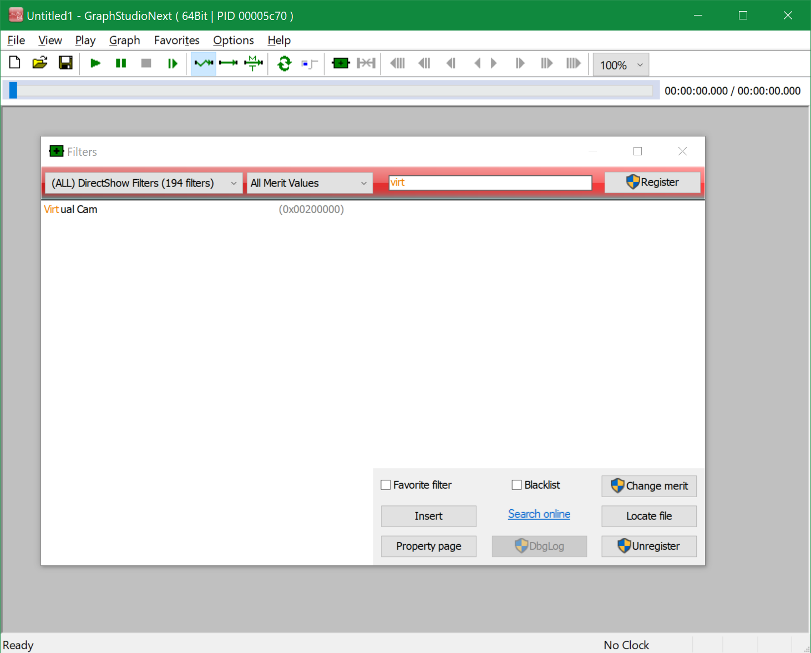
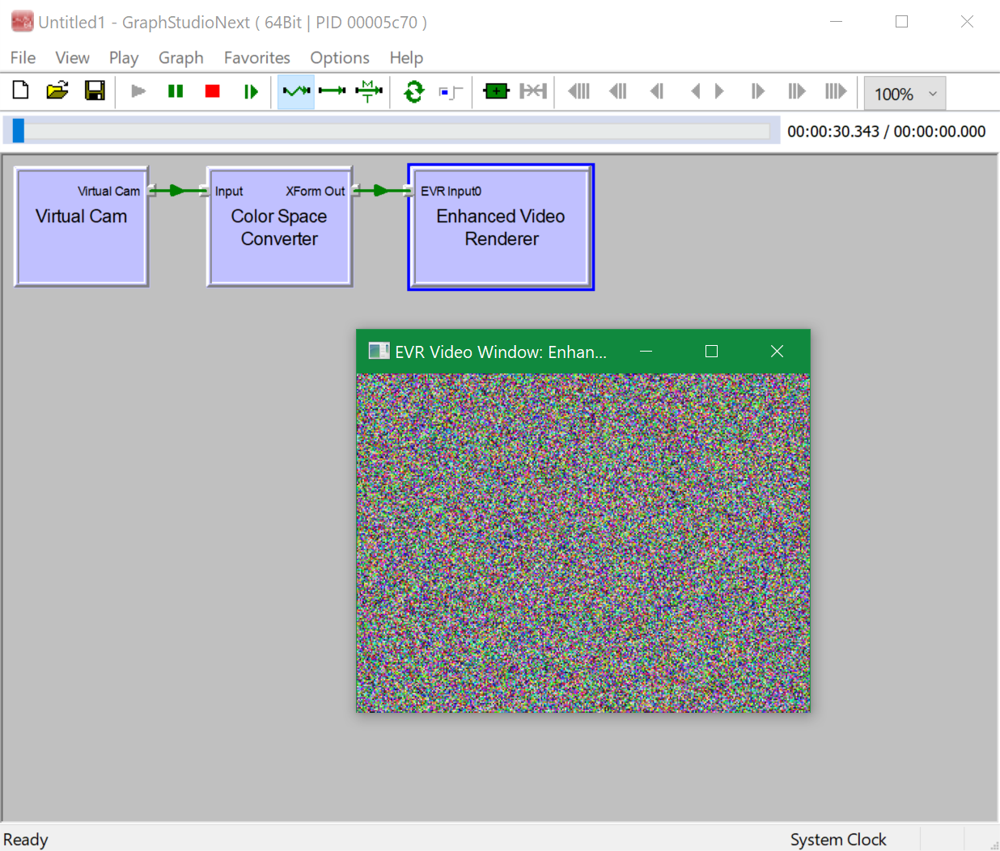

# DirectShow VCam - Intel Realsense camera 3D pointcloud projection

- RealSenseCam: displays Color, ColorizedDepth, ColorAlignedDepth, IR, (projected) PointCloud streams from a RealSense camera as a DirectShow filter that can be used as an input into various programs (e.g. Zoom) as a capture device stream
  - Note: The HEAD of the main branch contains all the RealSense and Direct3D11 dependencies
  - Note: Tag "vcam-base" contains the following changes from the originally-forked repo with no added dependencies:
(I thought I'd save my tweaks to get VCam building first as a base repo before I add further dependencies. By requiring the repos to be peer directories, we can avoid having to set some build properties by using relative paths, basically. Plus for some reason the baseclasses project was producing strmbase.lib outputs rather than BaseClasses.lib outputs - so rather than fork that repo too, I'll just roll with it and update the input libraries to expect strmbase/strmbasd in this project for linking to. Maybe I didn't follow the instructions properly...)

- Setup
  - Create a parent directory, e.g. VCam, then cd into it
  - git clone [this repo](https://github.com/CitizenOneX/vcam-realsense) (but don't cd into it)
  - git clone the [Windows-classic-samples repo](https://github.com/roman380/Windows-classic-samples) (as a peer directory to this repo)
  - Install [Windows 10.0.19041 SDK](https://developer.microsoft.com/en-us/windows/downloads/sdk-archive/) in its default location (mine installed to "C:\Program Files (x86)\Windows Kits\" ...) - other versions may work, but are untested
  - git clone the [Intel Realsense2 repo](https://github.com/IntelRealSense/librealsense) (as a peer directory to this repo)
- Building, Registering with Windows
  - Build the directshow/baseclasses project in VS2019 Community (produces strmbase/strmbasd.lib outputs - build Win32/x64 and Debug/Release as needed)
  - CMake, then build the Intel Realsense library in VS2019 Community (produces realsense2d.dll, realsense2.dll Debug/Release as needed, as well as realsense2.lib files, plus has the RealSense C++ header files for inclusion)
  - Build the Filters project from this solution in VS2019 Community (produces Filters.dll in each of Win32/x64, Debug/Release as needed)
  - in the Filters.dll output directory of your chosen configuration(s), execute "regsvr32 Filters.dll" in an Administrator command prompt.
  - Copy the corresponding 32/64 Debug/Release realsense2.dll alongside Filters.dll files (they need to be found at runtime)
- Testing
  - Open graph edit: e.g. To see 64-bit Filters.dll filters, use C:\Program Files (x86)\Windows Kits\10\bin\10.0.19041.0\x64\graphedt.exe
  - Insert Filter / Video Capture Sources / Virtual Cam
  - Insert Filter / Direct Show Filters / Enhanced Video Renderer
  - Connect Output pin of Virtual Cam node to Input pin of Enhanced Video Renderer Node (Color Space Converter Node automatically appears)
  - Press Play, see the stream from the default RealSenseCamType set in Filters.h:22-ish. (Currently a point cloud.)

## /End "Why This Fork?"

Original work by [Vivek](https://groups.google.com/g/microsoft.public.win32.programmer.directx.video/c/1beZkSCb0KE/m/5VF366wR3CcJ); community evidently owes much to [The March Hare](https://web.archive.org/web/20060813155608/http://tmhare.mvps.org/) and [roman380](https://github.com/roman380/tmhare.mvps.org-vcam). I also took a look at [KinectCam](https://github.com/dsouzae/KinectCam) Lots of help from the many Direct3D11 tutorials to get the point cloud rendering started. The render-to-texture-and-copy-back code ended up being closest to something like [carasuca's offscreen D3D](https://github.com/carasuca/MinimalOffscreenD3D)

See also:

* [How to build and run Vivek's Virtual Camera on Windows 10?](https://stackoverflow.com/a/65698434/868014)
* [Errors in building Vivek's Virtual Camera on Windows 10?](https://stackoverflow.com/a/65758769/868014)

## Updates

Orignial source code is tagged by [original](https://github.com/roman380/tmhare.mvps.org-vcam/releases/tag/original) tag. In this state the project needs a bit of massaging to be built.

The head of the repository is updated for Virtual Studio 2019 Community builds.

1. The project requires DirectShow BaseClasses, which is a part of Windows SDK moved to github. For this reason you need to pull https://github.com/roman380/Windows-classic-samples/tree/directshow/Samples/Win7Samples/multimedia/directshow (note branch "directshow") first and build the directshow.sln solution there (or at least BaseClasses project) first.
2. Then, edit [directshow.props](directshow.props) and modify line with `WindowsClassicSamplesDir` to have it point to root of repository from step 1 above
3. Then, open [vcam.sln](vcam.sln) and build this project

Differences from original version:

- output file name is Filters.dll (unlike original VCam.ax)
- the project is extended to have `x64` platform configuration
- Requires Intel [realsense2](https://github.com/IntelRealSense/librealsense) for interface with Realsense devices
- Requires DirectX11/Direct3D11 in the Windows 10 SDK.

## How to use

Use Widows 10 SDK GraphEdit or [GraphStudioNext](https://github.com/cplussharp/graph-studio-next).

Locate "Virtual Cam" filter:

Build a pipeline and run:

## Licensing

See [discussion in issue #4](https://github.com/roman380/tmhare.mvps.org-vcam/issues/4) on applicable license.

## Further information

The VCam project has been discussed a lot in various forums. Most of them are archived and there are no active disussions, however there is still a lot of information online. Just a few pointers:

- [https://social.msdn.microsoft.com/Forums/...](https://social.msdn.microsoft.com/Forums/en-US/home?category=&forum=&filter=&sort=relevancedesc&brandIgnore=true&searchTerm=VCam)
- [https://groups.google.com/g/microsoft.public.win32.programmer.directx.video/...](https://groups.google.com/g/microsoft.public.win32.programmer.directx.video/search?q=VCam)
- [https://stackoverflow.com/...](https://stackoverflow.com/search?q=VCam)
